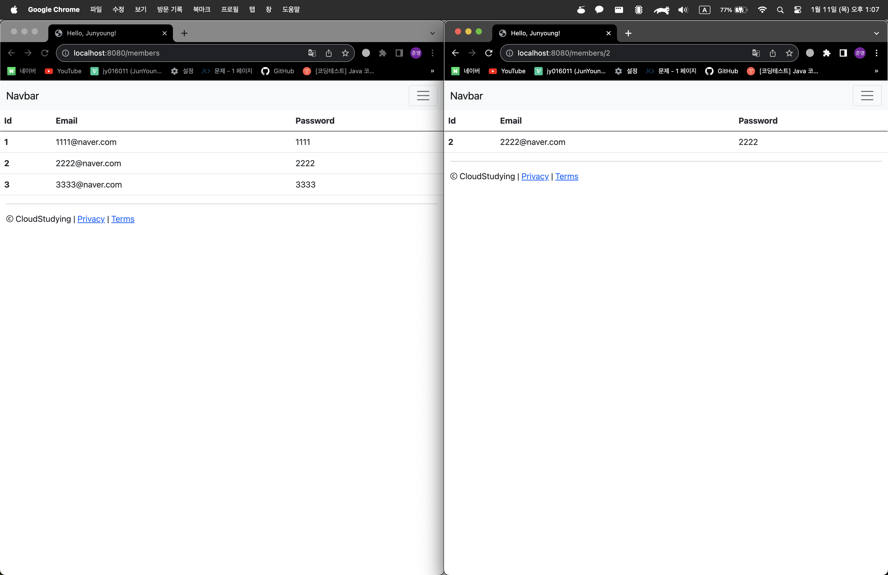

# 📖 스프링부트3 자바 백엔드 개발 입문 1주차

---

## 💡 1일차: 스프링부트 시작하기

### 1. 스프링부트 설치

- 교재에서는 스프링부터 3.1.0 버전, JDK 17버전 기준으로 함.
- 따라서 설치되어있던 JDK 20을 JDK 17버전으로 변경 후 설치

### 2. 프로젝트 실행

- `firstproject/src/main/java/com/example/firstproject` 내부의 `FirstprojectApplication`파일을 실행하여 실행
- 웹서버는 Tomcat을 이용하여 실행되며, 기본 8080포트에서 실행됨.

### 3. 브라우저를 통해 접속해보기

- `localhost:8080`을 입력하여 접속, 해당 주소에 어떤 파일도 없기 때문에 오류 발생
- `src/main/resources/static` 내부에 `hello.html` 파일 생성 후 `localhost:8080/hello.html`로 접속
- 스프링부트는 기본적으로 `src/main/resources/static` 을 기준으로 파일을 찾음

---

## 🎯 2일차: MVC 패턴 이해와 실습

### 1. 뷰 템플릿 생성

- 뷰 템플릿: 변수를 삽입하여 보여주고자 하는 웹페이지를 하나의 틀로 만들고, 각기 다른 변수 값으로 서로 다른 페이지를 보여주는 동적인 기술(어제 실습한 html은 정적이다.)
- 뷰 템플릿은 `src/main/resources/templates`에서 만들며, 여기서는 `mustache`파일을 이용하여 템플릿을 생성한다.
- `mustache`는 두겹의 중괄호(`{{변수 이름}}`) 으로 변수를 표현한다.

### 2. MVC 패턴의 이해

- Model(모델): 뷰 템플릿에 사용되는 데이터 관리
- View(뷰, 뷰 템플릿): 사용자가 보는 화면을 담당
- Controller(컨트롤러): 클라이언트의 요청을 받아 처리
- 따라서 사용자가 웹 브라우저를 통해 웹서버에 요청을 보내면, 웹서버의 `컨트롤러`가 이를 받아들여 `모델`의 데이터를 가져와 `뷰`에 적용하여 클라이언트에게 반환한다.

### 3. Spring Boot 에서의 MVC 패턴 실습

- **1.** 에서 생성한`src/main/resources/templates` 내부의 템플릿(mustache파일)이 뷰의 역할을 수행
- `src/main/java/com/example/firstproject/controller`내부에 컨트롤러 파일을 생성
    - `@Controller` 어노테이션을 통해 컨트롤러임을 명시(이러면 스프링 부트에서
      알아서 컨트롤러로 씀)
- 생성한 컨트롤러 클래스 내부에 클라이언트의 요청에 응답할 함수를 작성
    - `@GetMapping` 어노테이션을 통해 응답할 URL을 지정(이러면 지정한 URL에 응답한다.)
- 컨트롤러 함수는 모델을 인자로 가지며, 모델 객체는 `addAttribute()`를 통해 템플릿에 사용할 변수 값을 넣어준다.
- 컨트롤러 함수는 반환 값에 템플릿 이름만 기입하고, 이는 클라이언트에게 동일한 이름의 템플릿을 반환하는 일을 수행하게 된다.

### 4. 뷰 템플릿에 레이아웃 적용하기

- 레이아웃: 화면에 요소를 배치하는 일
- 오늘 실습 에서는 헤더-푸터 레이아웃 이용
- 부트스트랩(BootStrap): 웹 페이지를 쉽게 만들 수 있도록 웹 페이지의 요소들을 미리 작성해 놓은 코드 모음.
    - 실습 간에는 `5.0.2` 버전 이용
- `src/main/resources/templates` 내부에 `layouts` 디렉터리를 생성하여 이 내부에 헤더, 푸터와 같은 html 코드들을 템플릿 화 하여 관리
    - 각기 다른 뷰 템플릿에서 이들을 호출하여 코드의 중복을 방지하고, 코드를 간결하게 함.

---

## 📝 3일차: 게시판 만들고 새 글 작성하기(Create)

### 1. 폼데이터와 DTO

- 폼데이터: HTML요소인 `<form>`태그에 실려 전송되는 데이터
    - action 속성을 통해 서버의 어디로 데이터를 보낼지 지정
    - method 속성을 통해 `get`, `post` 중에서 방식을 지정할 수 있음.
- DTO: 폼데이터를 받은 컨트롤러는 이를 객체에 저장하는데 이를 DTO라고 함.
    - DTO의 데이터는 최종적으로 데이터베이스에 저장

### 2. 폼데이터 처리

- 컨트롤러를 통해 폼데이터를 처리
    - 폼데이터의 `method` 값에 따라 `GetMapping`혹은 `PostMapping` 하여 action의 경로 값과 동일하게 맵핑해야함
    - 폼데이터를 저장할 DTO는 필드로 폼데이터 내부의 저장할 데이터 이름과 같아야함.
        - 폼데이터에서 저장될 데이터 이름은 `name="변수명"`으로 기술

### 3. Entity와 Repository

- JPA: 자바 언어로 DB에 명령을 내리는 도구
- Entity: JPA의 요소로 자바 객체를 DB가 이해할 수 있도록 만든 클래스로 이를 기반으로 DB내부에 테이블이 만들어짐
    - `@Entity` 어노테이션으료 표시
    - `@Column` 표시한 필드 값이 테이블의 속성(열)이 됨.
    - `@Id` 표시한 필드가 행을 구분할 대표값(식별자)이 됨.
- Repository: 엔터티가 DB속 테이블에 저장 및 관리될 수 있게하는 인터페이스
    - 금일 실습에서는 `CrudRepository<T, ID>` 인터페이스를 상속받아 데이터를 저장
        - 여기서 `T`는 저장할 엔티터의 클래스 타입, `ÌD`는 엔터티의 대표값의 자료형
    - 여기서 인터페이스인 Repository의 구현체를 따로 구현할 필요 없이 `@Autowired`를 통해 스프링에서 스스로 생성한 객체와 연결해줌. 이를 의존성주입(DI)라고 함
        - 의존성 주입: 외부에서 만들어진 객체를 필요한 곳에 가져다 주는 것
        - CrudRepository 인터페이스는 이미 Spring Data JPA 패키지 안에 `SimpleJpaReposiroty.java`로 구현되어있음.
            - 이를 `@Autowired`로 의존성 주입해주는 것임.

### 4. 데이터 조회하기

- `src/main/resources/apllication.properties` 파일에 내용을 추가하여 스프링의 DB에 웹브라우저를 통해 접근가능
    - 실습간에는 `H2`데이터베이스(메모리에 저장)이므로 접속시 DB의 메모리 주소 필요
        - 서버 시작시마다 완전히 초기화되어(값도 날아감) 주소가 매번 바뀜
- `SELECT 속성명1, 속성명2... FROM 테이블이름` 구문을 통해 테이블 내부의 원하는 속성 값들을 불러올 수 있다.
- `INSERT INTO 테이블명(속성명1, 속성명2...) VALUES(값1, 값2..)`를 통해 테이블에 행을 추가할 수 있다.

---

## 🛠️ 4일차: 롬복과 리팩터링

### 1. 롬복이란?

- 롬복: 코드를 간소화 해주는 라이브러리
    - 롬복이 코드를 간소화하는 순서

            1. java 컴파일러가 소스파일을 파싱하여 AST트리를 만듬
            2. 롬복은 AnnotationProcessor에 따라 AST트리를 동적으로 수정하고 새 노드를 추가하고 바이트 코드를 분석 및 생성
            3. java 컴파일러는 롬복에 의해 수정된 AST를 기반으로 바이트 코드를 생성

    - 로깅도 가능하다.
        - 로깅: 프로그램의 수행 과정을 기록으로 남기는 것
        - `Sytem.out.println()`(줄여서 sout)으로 수정과정을 보는 것은 서버의 성능을 저하시키고 기록도 안되므로 로깅을 하자.

### 2. 롬복 설치

- `build.gradle` 파일에 `dependencies{}` 부분을 수정한 후 `Load Gradle Changes`를 통해 설치
    - `@Slf4j`의 로깅 이용간 로깅 함수를 찾을 수 없다는 에외 발생하였음.
        - IDE의 Settings -> Plugins -> Marketplace 에서 롬복을 설치하여 해결

### 3. 리팩터링

- 기존 코드에서의 생성자는 `@AllArgsConstructor` 1줄로 대체
- 기존 코드에서의 `toString()`은 `@ToString` 1줄로 대체
- 기존 코드에서의 수행과정을 임시로 보기위해 쓴 sout은 `@Slf4j`의 `log.info()`로 대체

---

## 🔍 5일차: 게시글 읽기(Read)

### 1. 데이터 조회 과정

    1. 사용자가 웹 페이지를 통해 URL 요청을 보낸다.
    2. 서버의 컨트롤러가 요청을 받아 URL에서 찾으려는 정보를 Repository에 전달한다.
    3. Repository는 해당되는 정보를 DB에 조회 요청한다.
    4. DB는 해당 데이터를 찾아 Entity로 반환한다.
    5. 반환된 엔터티는 모델을 통해 뷰 템플릿으로 전달한다.
    6. 뷰 페이지가 완성되어 사용자에게 전달되어 화면에 출력한다.

### 2. 데이터 조회하기

- 원하는 정보를 얻어야하므로 URL에 정보를 식별할 값을 넣어줌
    - 실습에서는 `Id`로 식별
- 컨트롤러에서는 `@xxMapping`의 URL 경로 값에 중괄호(`{변수명}`)로 감싸 식별자를 표시
- 또한, 컨트롤러 함수 인자에 `@PathVariable`을 추가하여 중괄호 안에 들어간 식별자를 함수 인자로 받도록 한다.
- Repository를 통해 `findById()`로 원하는 정보를 가진 엔터티를 받는다.
    - `findById()`는 `Optional<T>` 형태로 반환하므로 형변환을 하거나, `orElse()`를 붙인다.
- Entity를 Model의 `addAttribute()`를 통해 모델에 적용한다.
- 모델에 적용된 Entity의 정보는 뷰 템플릿에서 이중 중괄호(`{{entity명}}`)로 명시된다.
    - `{{#entity}}` ~ `{{/entity}}`로 Entity 정보를 이용할 영역을 명시한다.
    - 해당 영역 내에서 Entity의 `@Column`인 필드를 이중 중괄호(`{{필드명}}`)로 사용할 수 있다.
    - 모델에 담긴 Entity 정보가 `List<T>`와 같은 데이터 묶음일 경우 `{{#entity}}` ~ `{{/entity}}` 영역 내의 코드가 데이터 묶음만큼 반복된다.

---

## 1주차 결과물

- 웹 브라우저를 통한 데이터 입력/저장 및 불러오기
