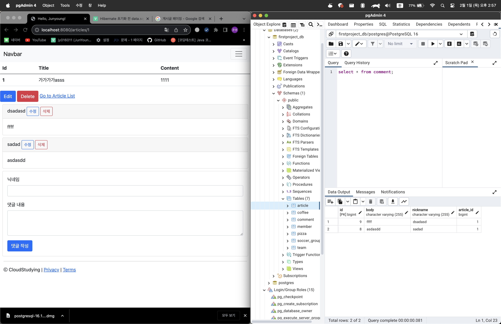

# 📖 스프링부트3 자바 백엔드 개발 입문 4주차

---

## 🔍 16일차: 웹 페이지에서 댓글 목록 보기

### 1. 댓글 보기의 개요

- 댓글의 레이아웃
    1. 기존 댓글을 보여주는 영역
    2. 새 댓글을 입력하는 영역


- 두 영역은 별도의 두 페이지를 만들어 게시글의 상세 페이지 아래에 삽입하는 형태로 구현

### 2. 댓글 뷰 페이지 삽입하기

- 댓글 뷰 페이지 호출 과정
    1. 클라이언트가 `/articles/{id}`로 `GET`요청을 보냄
    2. `ArticleController`가 요청을 받아 처리함
        - 댓글 목록 데이터를 모델에 반영
        - 모델은 반영된 데이터를 `show` -> `_comments` -> `_list`순으로 이동하여 뷰 페이지에 반영
        - 데이터가 반영된 `show`템플릿을 클라이언트에게 반환
    3. 사용자는 이제 게시글과 게시글의 댓글들을 볼 수 있음.


- `<div>`태그는 웹 페이지의 레이아웃을 만들 떄 사용, 웹 페이지의 영역을 논리적으로 구분

### 3. 댓글 목록 가져오기

- `ArticleController`에 `CommentService`를 의존성 주입하여 추가
- `CommentService`를 통해 댓글 DTO 목록을 가져와 모델에 반영하여 최종적으로 뷰에 반영

---

## 📝 17일차: 웹 페이지에서 댓글 등록하기

### 1. 댓글 등록의 개요

- 새 댓글을 등록하기 위한 뷰 페이지를 만들고 자바스크립트 코드로 REST API를 호출
- REST API 요청을 보낼 때 사용하는 자바 스크립트 API
    - `document.querySelector()`: 웹 페이지에서 특정 요소(버튼 등)를 찾아 반환
    - `요소명.addEventListener()`: 특정 요소에 이벤트가 발생(버튼 클릭 등)했을 때 특정 동작(댓글 데이터 전달 등)을 수행
    - `fetch()`: 웹 페이지에서 REST API요청(`POST`등)을 보냄

### 2. 댓글 생성 뷰 페이지 만들기

- 댓글은 부모 게시글의 id값을 가지고 있어어야 함
    - 이를 위해 부모 게시글의 id를 히든 인풋으로 삽입
        - 히든 인풋: 웹 페이지에 표시되지 않는 요소로 보이지는 않지만, 값을 가지고 있어야할 때 이용

### 3. 자바스크립트로 댓글 달기

- `document.querySelector()`: 웹 페이지의 특정 요소를 변수화한다고 보면됨
    - id, name, class, HTML 태그 등을 매개변수로 받음
        - id입력시 `#id값` 형식으로 받음

- `요소명.addEventListener()`: 해당하는 요소에 지정된 타입의 이벤트 발생시 지정된 함수 실행
- 객체 생성 3가지 방식: 리터럴 방식, 생성자 함수 방식, Object.create 방식
- 실습 간에는 리터럴 방식 사용
    ```
    var obejct = {
        key1: value1,
        key2: value2,
        ...
    }
    ```
- `fetch()`: 웹 페이지에서 HTTP 통신을 하는데 사용
    ```
    fetch('API_주소', {
        method: '요청_종류',
        headers: {
            "Content-Type": "application/json"
        },
        body: JSON.stringify(객체)
    }).then(response => {
        응답_처리문;
    });
    ```
    - `method`로 들어오는 값은 `POST`, `PATCH`와 같은 HTTP 요청 타입이 들어옴
    - `headers`의 값은 전송 본문의 데이터 타입 정보를 의미
    - `body `는 전송할 데이터의 내용(DB에 반영할 데이터 등)으로 객체를 JSON 문자열로 변환하여 보낸다.
    - `then(response)`는 보낸 REST API 요청에 대한 응답을 처리, 여기서 `response`가 요청의 응답임.


- `JSON.stringify()`는 객체를 입력 받아 JSON 문자열로 변환

---

## 🖍️ 18일차: 웹 페이지에서 댓글 수정하기

### 1. 댓글 수정의 개요

- Modal(모달): 웹 페이지 내부에서 새 창이 아닌 상위 레이어를 띄우는 방식으로 모달 창이 뜨면,
  기존 창은 비활성화되어 모달 창을 종료했을 때 원래 화면으로 돌아옴
- 댓글 수정 구현 과정
    1. 모달 기능을 이용해 모달 창에 수정 폼 만들기
    2. 모달 트리거 버튼을 통해 기존 댓글을 가져와 수정폼에 반영하여 사용자 화면에 보여줌
    3. 사용자가 수정한 내용을 입력 받아 REST API 요청을 보냄

### 2. 댓글 수정 뷰 페이지 만들기

- 모달 트리거 버튼의 `data-bs-xx` 속성
    - `data-bs-toggle="modal"`: 클릭하면 모달이 나타나고, 다시 클릭하면 사라지는 토글 속성
    - `data-bs-target="#modalID"`: 해당 id의 모달 실행
    - `data-bs-whatever={{변수명}}`: 데이터 속성이라고 부르며, HTML 요소에 추기 정보를 저장하고 싶을 때 사용

### 3. 자바스크립트로 댓글 수정하기

- 모달 동작의 이벤트 타입
    - `show.bs.modal`: 모달이 표시되기 직전 실행되는 이벤트
    - `shown.bs.modal`: 모달이 표시된 직후 실행되는 이벤트
    - `hide.bs.modal`: 모달이 숨겨지기 직전 실행되는 이벤트
    - `hidden.bs.modal`: 모달이 숨겨진 후 실행되는 이벤트
- `요소.addEventListener("이벤트", function(event){})`: 요소에 `"이벤트"`에 해당하는 이벤트 발생시 `function(event)`를 수행
    - 여기서 `function(event)`의 인자인 `event`는 `"이벤트"`에 해당하는 이벤트를 의미
    - `function(event)`내부에서 `event.target`은 이벤트의 대상 즉, 위의 `요소.addEventListener()`의 요소가 됨.
    - `event.relatedTarget`은 Target인 요소를 호출한 트리거를 의미
- `요소.getAttribute("속성명")`: `요소`의 `"속성명"`에 해당하는 속성의 값을 가져옴

### 4. 뷰 페이지에서의 댓글 수정 데이터의 흐름

1. `_comments.mustache`는 `_list.mustache`를 불러 댓글 목록을 표시
2. `_list`내부의 댓글을 표시하는 태그에는 댓글의 데이터(id, articleId, nickname, body)가 포함되어있음.
3. `_list`의 댓글을 표시하는 태그 내부에는 모달 창을 띄우는 `수정`버튼이 있음.
4. 이 `수정`버튼은 해당 댓글의 데이터(id, articleId, nickname, body)를 저장하고 있음.
5. `수정`버튼이 눌리면 모달 창이 발생하고, 발생된 모달은 `show.bs.modal`이벤트를 발생시킴
6. 발생한 이벤트를 `addEventListener()`가 처리하며, 이벤트를 불러 일으킨 트리거인 `수정`버튼으로부터 해당 댓글의 데이터를 불러옴.
7. 불러온 댓글의 데이터는 모달 창에 켜지면서 생기는 폼 데이터에 실리게됨
8. 폼데이터에 실린 댓글의 데이터는 사용자 화면에 보여짐
9. 사용자는 댓글의 닉네임 혹은 내용 혹은 둘다를 수정하고 `수정 완료` 버튼을 클릭
10. `수정 완료`버튼 클릭 이벤트가 발생하여 사용자가 수정한 내용 + 폼데이터가 가지고있던 댓글 id, 게시글 id를 통해 `comment`객체로 생성.
11. 생성한 `comment`객체를 JSON 문자열 데이터로 변환하여 `PATCH`요청으로 REST API에 요청을 보냄
12. 보내진 댓글 수정 데이터는 DB에 반영이 될 것임.

---

## ❌ 19일차: 웹 페이지에서 댓글 삭제하기

### 1. 댓글 삭제의 개요

- 댓글 삭제 과정
    1. 댓글 `삭제` 버튼 추가
    2. `삭제` 버튼 클릭해서 REST API 요청 보내기

### 2. 댓글 `삭제` 버튼 추가하기

- `_list.mustache`의 댓글을 보여주는 요소 내에 `삭제`버튼 추가
- `삭제`버튼의 속성에 해당 댓글의 id 값 추가
- 이번 실습 간에는 요소 선택시 id 말고 class 속성 값 사용
  ```
  document.querySelector(".class속성명");
  ```

### 3. 자바스크립트로 댓글 삭제하기

**가)** `삭제` 버튼을 요소로 가져옴

- 모든 댓글의 `삭제`버튼을 가져와야하므로 `querySelectorAll()`을 사용

**나)** 삭제 버튼에 대한 이벤트 처리

- 삭제 버튼을 복수 개로 가져왔으므로 `요소.forEach()`구문을 사용한다.
- 사용 예시
  ```
  commentDeleteBtns.forEach(function() {
  
  ...
  
  });
  ```
- 각 `삭제`버튼으로부터 각 댓글의 id를 가져옴
- 삭제할 댓글의 id를 조합하여 `DELETE`요청을 처리할 REST API의 url 생성
- `fetch()`를 통해 해당 url로 `DELETE`요청을 보냄
- 삭제 요청 후 응답에 따라 다음을 처리
    - 실패시: 댓글 삭제 실패 알림창 띄우기
    - 성공시: 댓글 삭제 성공 알림창 띄우고, `해당_댓글_요소.remove()`로 웹 페이지에서 댓글을 지우고 새로고침

### 4. 외부 DB(PostgreSQL) 연동하기

- 외부 DB 설치
- `build.gradle`에 PostgreSQL 드라이브 추가
  ```
  runtimeOnly 'org.postgresql:postgresql'
  ```
- `application.properties`에 DB옵션 추가
    - 데이터 초기화 설정
      ```
      spring.sql.init.data-location=classpath:data.sql
      ```
    - 데이터 초기화 여부 설정
      ```
      spring.sql.init.mode=always // 항상 초기화
      spring.sql.init.mode=never  // 초기화 안함
      ```
    - 서버 시작시 DDL 설정
      ```
      spring.jpa.hibernate.ddl-auto=옵션
      ```
        - 옵션 종류
            1. `create`: 엔터티로 등록된 클래스와 매핑되는 테이블을 자동으로 생성,

               테이블이 있을 시 기존 삭제 후 새로 생성
            2. `create-drop`: 시작시 `create` + 서버 종료시 테이블 삭제
            3. `update`: 엔터티로 등록된 클래스와 매핑된 테이블 없을 경우 새로 생성,

               테이블 있을 시 새로 생성되는 칼럼만 업데이트, 칼럼의 속성은 거드리지 않음
            4. `validate`: 엔터티 클래스와 테이블이 정상적으로 매핑되어있는지만 검사,

               테이블이 없거나, 엔터티의 필드와 테이블의 칼럼이 다르면 예외 발생 후 애플리케이션 종료
            5. `none(default)`: 위 4가지를 제외한 모든 경우, 아무일도 일어나지 않음

---

## 📌 4주차 결과물



- 웹 페이지에서 자바스크립트로 REST API 호출하여 댓글 CRUD 하기 / PostgreSQL 연동

---

## 📔 책을 마무리하며

### 1. 책 후기 및 느낀점

- 책이 누구나 따라올 수 있게 실습 과정이 친절하게 설명되어 있어 학습하는데 큰 무리가 없었습니다.

  개념 설명도 대체로 잘 되어있어서 좋았습니다.

  그래도 처음보는 용어나 개념은 인터넷 검색을 통해 찾아보고 이해하고자 하였습니다.

  학습하는 동안 MVC 패턴, 서비스 계층 구현, 테스트코드 작성, SQL, HTTP, JSON, REST API 실습을 통해 웹 서비스의 큰 그림과

  SpringBoot의 구성과 기능들을 이해할 수 있었습니다.

  여기에 필요하다고 생각하는 기능들을 추가하여 완전한 게시판 서비스를 만드는 것이 목표입니다.

### 2. 앞으로 할 것

- [ ] 게시글의 작성시간 및 조회수 칼럼 추가
- [ ] 댓글의 작성시간 칼럼 추가
- [ ] 게시글 페이징 기능 추가
- [ ] 검색 기능 추가
- [ ] 레이아웃 구성 바꾸기
- [ ] 회원가입, 로그인, 권한 기능 추가
- [ ] AWS 배포

---