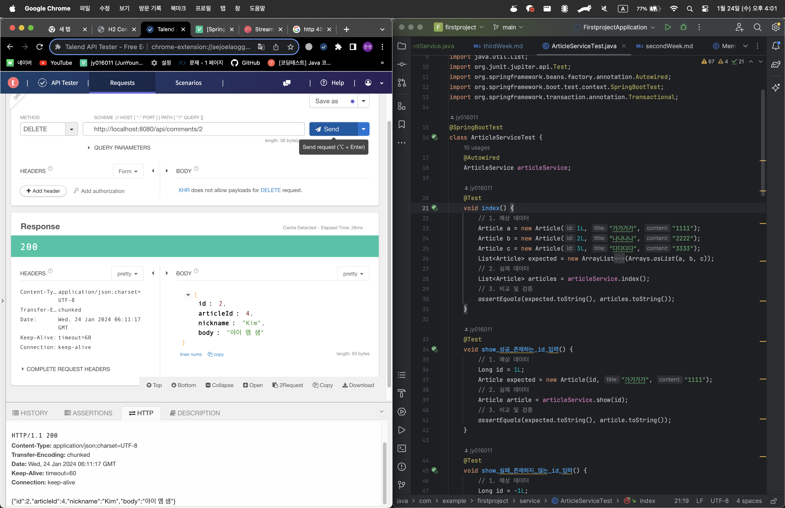

# 📖 스프링부트3 자바 백엔드 개발 입문 3주차

---

## 💡 11일차: HTTP와 REST 컨트롤러

### 1. REST API의 동작 이해하기

- JSON의 값으로 내부에 또 다른 JSON을 넣거나, 배열을 넣을 수 있음.
- REST: HTTP URL로 서버의 자원을 명시하고, HTTP 메서드로 해당 자원에 대해 CRUD하는 것
- API: 클라이언트가 서버의 자원을 요청할 수 있도록 서버에서 제공하는 인터페이스
- REST API는 즉, REST를 기반으로 API를 구현한 것임.
    - 클라이언트가 기기에 구애받지 않고 서버의 자원 이용 가능
    - 서버 프로그램의 재사용성과 확장성이 좋아짐

### 2. REST API 구현하기

- REST API를 구현하는 컨트롤러에는 `@RestController` 어노테이션을 붙임
- REST 컨트롤러는 JSON이나 텍스트 같은 데이터를 반환(일반 컨트롤러는 뷰 페이지를 반환)
- REST API에서는 dto 매개변수 앞에 `@RequestBody`라는 어노테이션을 붙여야 요청으로 오는 JSON 데이터를 받을 수 있음.
- `ResponseEntity`클래스는 REST API의 응답을 위해 사용하는 클래스
    - REST API 요청을 받아 응답할 때 이 클래스에 HTTP 상태코드, 헤더, 본문을 실어 보낼 수 있음.
- `HttpStatus`클래스는 HTTP 상태코드를 관리하는 클래스.
    - 다양한 Enum타입과 관련 메서드를 가짐
        - `HttpStatus.OK`: HTTP 200
        - `HttpStatus.CREATED`: HTTP 201
        - `HttpStatus.BAD_REQUEST`: HTTP 400
- `PATCH`메서드의 경우 일부 데이터만 수정할 수도 있으므로 null 데이터가 덮어 쓰여지지 않도록 값이 있는 데이터만 수정되도록 주의하여 코딩할 것
    - 요청으로 들어온 수정 데이터 중 null 값이 아닌 데이터만 새로 수정한다는 지 등

---

## ⚙️ 12일차: 서비스 계층과 트랜잭션

### 1. 서비스와 트랜잭션의 개념

- 서비스: 컨트롤러와 리퍼지터리 사이에 위치하는 계층으로 서버의 비즈니스 로직(핵심 기능)을 처리하는 순서를 총괄함
    - 일반적으로 서비스는 `트랜잭션(transaction)`단위로 진행됨
- 트랜잭션: 모두 성공해야하는 쪼갤 수 없는 업무의 최소 단위
    - 트랜잭션 중간에 실패하면 이전의 트랜잭션 과정들은 모두 롤백됨

### 2. 서비스 계층 만들기

- `@Service` 어노테이션은 해당 클래스를 서비스로 인식해 스프링 부트가 서비스 객체를 생성
    - 컨트롤러는 `@Autowired`를 통해 서비스 객체를 이용할 수 있음.
- 컨트롤러는 클라이언트의 요청을 접수하고 응답하는 역할만 수행
- 서비스는 비즈니스 로직을 수행하고, 그 과정에서 필요한 데이터를 리파지터리를 통해 DB로부터 불러옴.
- 서비스는 로직을 수행한 후 엔터티 객체(혹은 `null`)을 반환
- 컨트롤러는 서비스의 반환 값에 따라 HTTP 상태 코드를 담은 응답(`ResponseEntity`)을 반환

### 3. 트랜잭션 맛보기

- 보통의 트랜잭션은 서비스에서 관리
- 서비스의 메서드에 `@Transactional`을 붙이면 해당 메서드는 하나의 트랜잭션으로 취급됨.
    - 클래스에 선언시 클래스의 모든 메서드에 각각의 트랜잭션이 부여됨.
- 중간에 작업이 실패하면 작업 시작 전 상태로 `롤백`

---

## 🧪 13일차: 테스트코드 작성하기

### 1. 테스트란

- 테스트: 프로그램의 품질을 검증하는 것으로 의도대로 프로그램이 잘 동작하는지 확인하는 과정
- 테스트의 종류
    - 통합 테스트: 서버릴 실행시켜 실제 환경과 유사한 상황에서 테스트
    - 단위 테스트: 테스트하고 싶은 메서드만 테스트
    - E2E 테스트: 서버의 경우 HTTP 응답을 테스트
- 테스트 코드 작성 과정
    1. 예상 데이터 작성하기
    2. 실제 데이터 획득하기
    3. 예상 데이터와 실제 데이터 비교해 검증하기
- 작성한 테스트 코드를 통과하면 지속적인 리팩터링으로 코드를 개선, 통과 못하면 디버깅 수행
- 테스트 코드는 성공할 경우 뽄만 아니라 실패할 경우도 고려한다. 이 경우들을 테스트 케이스라 부름
- 테스트 주도 개발(TDD) 일단 테스트 코드를 먼저 작성 후 이를 통과하는 최소한의 코드부터 시작해 점진적으로 코드를 개선 및 확장해 내가는 개발 방식

### 2. 테스트 코드 작성하기

- `test` 디렉터리는 `main/java/...` 디렉터리와 데칼코마니처럼 `test/java/...`와 같이 생성
- `@SpringBootTest`: 해당 클래스를 스프링부트와 연동해 통합테스트를 수행하겠다고 선언
    - `Autowired`를 통해 SpringContext에 있는 Bean과 필드를 묶어줌
- `@Test`: 해당 메서드가 테스트를 위한 코드라고 선언하는 어노테이션
- 테스트시 데이터 조회를 제외한 CUD 작업들은 테스트 종료 후 롤백이 필요함
    - 해딩 메서드에 `@Transactional` 사용

---

## 💬 14일차: 댓글 엔티티와 레퍼지터리 만들기

### 1. 댓글 기능의 개요

- 댓글과 게시판의 관계: 다대일 관계, 댓글에는 게시글의 PK(기본키)인 article.id를 FK(외래키)로 가짐
- JPA에서 단순히 CRUD 작업만 한다면 CrudRepository로 충분하나, CRUD + 페이지 처리와 정렬 작업까지한다면 JpaRepository를 사용
- JpaRepository: ListCrudRepository와 ListPagingAndSortingRepository를 상속받은 인터페이스
    - CRUD 기능
    - 엔터티를 페이지 단위로 조회 및 정렬하는 기능
    - 이외 JPA 특화 기능 제공

### 2. 댓글 엔터티 만들기

- `@ManyToOne`: 엔터티와 필드가 가리키는 엔터티를 다대일 관계로 설정
- `@JoinColumn`: name 속성으로 매핑할 외래키 이름을 지정하고 가리키는 엔터티의 기본키와 매핑하여 외래키 지정

### 3. 댓글 리파지터리 만들기

- 네이티브 쿼리 메서드: 직접 작성한 SQL 쿼리를 리파지터리 메서드로 실행할 수 있게 해줌
    - `@Query`: JPQL이라는 객체 지향 쿼리 언어를 통해 복잡한 쿼리 처리 지원
        - native 속성을 true로하면 기존 SQL문 사용 가능
        - `WHERE`절의 조건 작성시 매개변수 앞에 콜론(`:`)를 붙여줘야함
        - 예시
          ```java
          @Query(value = "SELECT * FROM comment WHERE article_id = :articleId, nativeQuery = true)
          List<Comment> findByArticleId(Long articleId);
          ```
    - 네이티브 처리 XML: 메서드에서 수행할 쿼리를 XML로 작성한 것
        - 경로 및 파일이름: `resources/META-INF/orm.xml`
        - 예시
          ```xml
          <named-native-query
                name="Comment.findByNickname"
                result-class="com.example.firstproject.entity.Comment">
          <query>
            <![CDATA[
                SELECT * FROM comment WHERE nickname = :nickname
            ]]>
          </query>
          </named-native-query>
          ```

- `@DataJpaTest`: JPA와 연동한 테스트를 진행, 리파지터리와 엔터티 등의 객체를 테스트 코드에서 사용 가능

---

## 🛠️ 15일차: 댓글 컨트롤러와 서비스 만들기

### 1. 댓글 REST API의 개요

- 예상 프로젝트 구조
    1. 컨트롤러
        - `api/CommentApiController`: 댓글 REST 컨트롤러
    2. DTO, Entity
        - `dto/CommentDto`: 댓글 JSON 데이터 전송
        - `entity/Comment`: 서버와 DB간 데이터 매핑 및 로직 처리
    3. Reposiroty
        - `reposiroty/CommentReposiroty`: CRUD 지원 JAP 인터페이스
    4. Service
        - `service/CommentService`: 컨트롤러와 레퍼지터리 사이에서의 흐름 처리 및 트랜잭션 관리

### 2. 댓글 컨트롤러와 서비스 틀 만들기

- `CommentApiController`: `@RestController`선언
- `CommentService`: `@Service`선언, `CommentRepository`, `ÀrticleRepository` 선언 후 `@Autowired`로 의존성 주입

### 3. 댓글 조회(`GET`)

- `ResponseEntity`에 `CommentDto`를 담아 반환
- 실습 간에는 댓글 조회 실패시 SpringBoot가 예외처리 한다고 가정

### 4. 댓글 생성(`POST`)

- DB 내용을 바꾸는 생성은 `@Transactional` 기입
- 예외처리
    - DTO에 id가 이미 존재하는 경우(엔터티의 id는 DB가 알아서 생성하므로 없어야함)
    - URL의 게시글 id와 dto의 게시글 id가 다른 경우
- JSON 데이터의 키 이름과 DTO의 변수 명이 다를 경우 `@JsonProperty("키이름")`을 해당하는 DTO 필드 위에 작성

### 5. 댓글 수정(`PATCH`)

- DB 내용을 바꾸므로 `@Transactional` 기입
- 예외처리
    - URL의 댓글 id와 DTO의 댓글 id가 다를 경우

### 6. 댓글 삭제하기(`DELETE`)

- DB 내용을 바꾸므로 `@Transactional` 기입
- 예외처리
    - URL로 받은 id의 댓글이 존재하지 않는 경우

---

## 📌 3주차 결과물



- REST API를 이용한 댓글 CRUD 기능 / 서비스 계층 추가 및 테스트 코드 작성